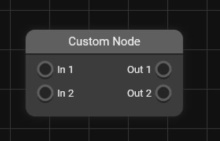

# JS Node Editor


This software is ONLY FOR PERSONAL USE. If you try to remove copyright signs we will have to take legal action against you. Please contact us if you want to use it for commercial purpose. (https://corvin-rose.de/contact)
<br>
<br>

## Getting Started
To install the JS Node Editor, just add the script to the bottom of your document:
```html
</body>
    <!-- ... -->
    <script src="node-editor.min.js"></script>
</body>
```

Add a `<node-editor>` tag to your html. Important: you can only use one editor per page!
```html
</body>
    <node-editor></node-editor>
    <!-- ... -->
</body>
```

You can position and style the editor as you like: (e.g. `style.css`)
```css
node-editor {
    width: 100%;
    height: 100%;
}
```
<br>
<br>

## Navigating inside the Editor
<strong>Moving around</strong>: Press mouse wheel and drag your mouse to move around.

<strong>Zooming</strong>: Scroll up or down to zoom in or out.

<strong>Add Nodes</strong>: Right click inside the editor to open up a context menu for adding nodes. Select the desired node.

<strong>Edit Nodes</strong>: Right click on an existing node to open up a context menu for editing nodes.

<br>
<br>

## Editor Properties
`theme` - With this property you can set the color appearance of the editor.<br>
Possible values: `light` or `dark`
```html
<node-editor theme="dark"></node-editor>
```
You can set custom themes in json format: (e.g. `theme.json`)
```json
{
    "editor-background":"#111111",
    "editor-text-color":"#f2f2f2",
    "editor-grid-color":"#333333",
    "menu-background":"#2b2b2b",
    "menu-text-color":"#f2f2f2",
    "menu-accent-color":"#414141",
    "menu-shadow-color":"#000000",
    "node-background":"#3c3c3c",
    "node-accent-color":"#5f5f5f",
    "node-text-color":"#f2f2f2",
    "node-shadow-color":"#252525",
    "node-primary-color":"#2489d4",
    "node-secondary-color":"#20b2aa"
}
```
The theme can be injected as follows: (e.g. `index.js`)
```js
let editor = document.getElementById('node-editor');
editor.theme = `[json]`;
```
<br>

`nodes` - With this property you can setup custom nodes in json format, that appear in the editor.
```js
let editor = document.getElementById('node-editor');
editor.nodes = `[json]`;
```
The json format of a custom node lookes like this:
```json
[
    {
        "type":"custom-node",
        "title":"Custom Node",
        "inputs":[
            "In 1",
            "In 2"
        ],
        "outputs":[
            "Out 1",
            "Out 2"
        ]
    }
    ...
]
```


Optionally you can set a color for a speific node:
```json
[
    {
        "type":"custom-node",
        "title":"Custom Node",
        "color":"#599",
        ...
    }
    ...
]
```


Also it is possible to add nodes with input. Those inputs can be varified with regex:
```json
{
    "type":"value-node",
    "title":"Value",
    "values":[
        {
            "boxsize":50,
            "label":"Num",
            "regex":"[0-9]*"
        }
    ]
}
```

<br>

`data` - With this property you can set the node data of the editor with json. This can be useful if you want to save and load editor states.
```js
let editor = document.getElementById('node-editor');
editor.data = `[json]`;
```
<br>

`font` - With this property you can change the font of the editor.
```html
<node-editor font="Roboto-Regular.ttf"></node-editor>
```
<br>

`grid` - With this property you can set the size of the editor grid.
```html
<node-editor grid="20"></node-editor>
```
<br>

`readonly` - With this property you can enable the readonly mode.
```html
<node-editor readonly></node-editor>
```
<br>
<br>

## Editor Events
`OnInit` - An event, that is fired, when the editor finished initializing.
```js
editor.addEventListener('OnInit', (e) => console.log('OnInit'));
```

`OnError` - An event, that is fired, when an error has been occured.
```js
editor.addEventListener('OnError', (e) => console.log('OnError:', e.error));
```

`OnDataLoaded` - An event, that is fired, when the json data inserted was processed and fully loaded.
```js
editor.addEventListener('OnDataLoaded', (e) => console.log('OnDataLoaded'));
```

`OnAddNode` - An event, that is fired, when a node was added.
```js
editor.addEventListener('OnAddNode', (e) => console.log('OnAddNode:', e.node));
```

`OnDeleteNode` - An event, that is fired, when a node was deleted.
```js
editor.addEventListener('OnDeleteNode', (e) => console.log('OnDeleteNode:', e.node));
```

`OnConnectNode` - An event, that is fired, when two nodes where connected.
```js
editor.addEventListener('OnConnectNode', (e) => console.log('OnConnectNode:', e.input, e.output));
```

`OnDisconnectNode` - An event, that is fired, when a connection was removed.
```js
editor.addEventListener('OnDisconnectNode', (e) => console.log('OnDisconnectNode:', e.input, e.output));
```

`OnValueNodeInput` - An event, that is fired, when the value of a value node has changed.
```js
editor.addEventListener('OnValueNodeInput', (e) => console.log('OnValueNodeInput:', e.node, e.value));
```

`OnMoveEditor` - An event, that is fired, when the user moves the editor.
```js
editor.addEventListener('OnMoveEditor', (position) => console.log('OnMoveEditor:', position));
```

`OnZoomEditor` - An event, that is fired, when the user zooms the editor.
```js
editor.addEventListener('OnZoomEditor', (zoom) => console.log('OnZoomEditor:', zoom));
```
<br>
<br>

## Example
You may ask how to use the node editor. Here is an example, which uses the nodes to create a math formular. Keep in mind, that this is only for demonstration so the features are limited:

You can find the source code inside the `example` folder. Note: you need a running server (e.g. Apache) to execute the example properly.

<br>
<br>
© Corvin Rose

